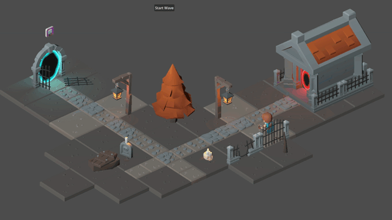

# Tarot Defence

Tarot Defence ist ein Tower-Defense-Spiel, das mit der Godot Engine entwickelt wurde. Momentan befindet sich das Spiel in der frühen Entwicklungsphase, und es werden noch viele Funktionen hinzugefügt.

